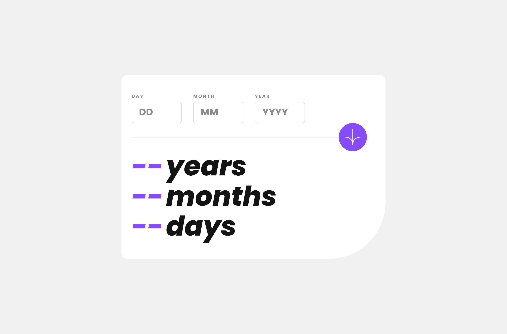

# Frontend Mentor - Age calculator app solution

This is a solution to the [Age calculator app challenge on Frontend Mentor](https://www.frontendmentor.io/challenges/age-calculator-app-dF9DFFpj-Q). Frontend Mentor challenges help you improve your coding skills by building realistic projects.

## Table of contents

- [Overview](#overview)
  - [The challenge](#the-challenge)
  - [Screenshot](#screenshot)
  - [Links](#links)
- [My process](#my-process)
  - [Built with](#built-with)
  - [What I learned](#what-i-learned)
  - [Continued development](#continued-development)
- [Author](#author)

## Overview

### The challenge

Users should be able to:

- View an age in years, months, and days after submitting a valid date through the form
- Receive validation errors if:
  - Any field is empty when the form is submitted
  - The day number is not between 1-31
  - The month number is not between 1-12
  - The year is in the future
  - The date is invalid e.g. 31/04/1991 (there are 30 days in April)
- Add the total extra days of the previous leap years
- View the optimal layout for the interface depending on their device's screen size
- See hover and focus states for all interactive elements on the page
- On click enter the form submits the values
- **Bonus**: See the age numbers animate to their final number when the form is submitted

### Screenshot

### Links

- Solution URL: [Here](https://github.com/Irbaine/age-calculator-fem)
- Live Site URL: [Here](https://irbaine.github.io/age-calculator-fem/)

## My process

I used Nextjs 13 and Tailwind Css for styling and Framer-motion for animations.
The logic of the app took me a little bit of time, especially for the leap years which contain one additional day that should be added to the result, I also took into consediration the problem of negative results.
I did manual testing of the app which may not be ideal for bigger future projects cause it's time consuming and challenging for small forms like this one.

### Built with

- [React](https://reactjs.org/) - JS library 
- [Next.js](https://nextjs.org/) - React framework 
- [Tailwind CSS](https://tailwindcss.com/) - For styles 
- [Framer Motion](https://www.framer.com) - For Animation 

### What I learned

This challenge seems very easy at first, and i was thinking that i would solve it in a less than one day...
But it seems that the input validation is not an easy process and it take much time for implementing and testing code manually,
The use of libraries is important for future project in these cases as the forms gets more large and complicated the data validation would be then more challenging to deal with which increases the chances for more bugs and leads to a bigger code.

### Continued development

Architecture problems were the most challenging part of my current learning process.
Should i use useMemo ? useEffect... ? good decision making, giving me hard times to adapt with react hooks easily.
I want to be more comfortable making the right decision with the structure to produce effecient minimized codes with no memory leaks.

## Author

- Website - [Irbaine](https://www.irbaine.com)
- Frontend Mentor - [Irbaine](https://www.frontendmentor.io/profile/irbaine)
- Twitter - [Amineirb](https://twitter.com/amineirb)
